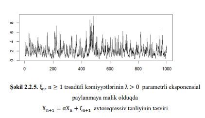

# Autoregressive Chaotic Systems Analysis in R

## Overview
This project explores autoregressive processes exhibiting chaotic behavior
through statistical and probabilistic analysis. The study is aligned with
academic research in time series analysis, chaos theory, and stochastic systems.

## Research Focus
- Autoregressive processes
- Chaotic system behavior
- Statistical properties of time series
- Probabilistic interpretation of dynamic systems

## Tools & Technologies
- R Programming
- Time Series Analysis
- Probability Theory
- Statistical Modeling
- Data Visualization

## Methodology
- Exploratory data analysis
- Simulation of autoregressive processes
- Visualization of system behavior
- Interpretation using statistical theory

## Visual Outputs
The project includes time series plots, histograms, and autocorrelation
functions to illustrate system dynamics.## Visualizations

### Time Series Behavior

### Distribution of Values

### Autocorrelation Structure

## Academic Context
This project is related to master's level research in Probability Theory
and Mathematical Statistics and supports dissertation work on chaotic systems.

## Author
**Madina Manafova**  
MSc in Probability Theory and Mathematical Statistics  
IBM SkillsBuild – Data Fundamentals (Verified Credential)
